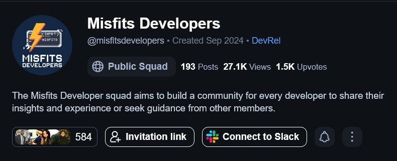

# Grenish Rai

A modern, responsive personal portfolio website built with Next.js 15, TypeScript, and TailwindCSS. Features a sleek dark theme, smooth animations, and interactive contact form with email notifications.

## ✨ Features

- **Modern Design**: Clean, minimalist interface with dark theme
- **Responsive Layout**: Optimized for all devices and screen sizes
- **Interactive Hero Section**: Dynamic animations and effects
- **Project Showcase**: Detailed project cards with links and descriptions
- **Hackathon Timeline**: Visual timeline of hackathon participations
- **Blog System**: Dynamic blog posts with markdown support
- **Contact Form**: Functional contact form with email notifications via Resend
- **SEO Optimized**: Built-in SEO with sitemap and robots.txt
- **Performance Optimized**: Fast loading with Next.js optimizations

## 🛠️ Tech Stack

- **Framework**: [Next.js 15](https://nextjs.org/) with App Router
- **Language**: [TypeScript](https://www.typescriptlang.org/)
- **Styling**: [TailwindCSS](https://tailwindcss.com/)
- **Animations**: [GSAP](https://greensock.com/gsap/)
- **Email**: [Resend](https://resend.com/) + [React Email](https://react.email/)
- **Markdown**: [React Markdown](https://github.com/remarkjs/react-markdown)
- **Icons**: [Lucide React](https://lucide.dev/)
- **Package Manager**: [Bun](https://bun.sh/)

## 🙏 Acknowledgments

- [Next.js](https://nextjs.org/) for the amazing framework
- [TailwindCSS](https://tailwindcss.com/) for the utility-first CSS
- [Vercel](https://vercel.com/) for hosting
- [Resend](https://resend.com/) for email delivery

## 📞 Contact

- **Website**: [grenishrai.icu](https://grenishrai.icu)
- **Email**: mrcoder2033d@gmail.com
- **GitHub**: [@Grenish](https://github.com/Grenish)
- **LinkedIn**: [grenish-rai](https://linkedin.com/in/grenish-rai)

---

⭐ Star this repo if you found it helpful!
